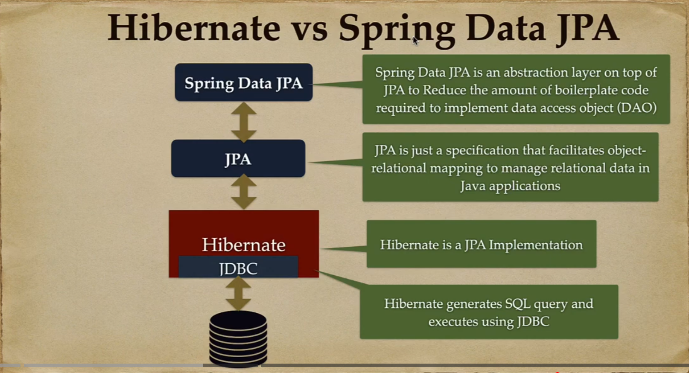

# `Hibernate` & Spring Data JPA

## **1. `Hibernate`**

> _Bản chất `Hibernate` là **ORM Framework** - lõi ORM - **trực tiếp triển khai** các quy tắc của JPA, thực hiện **generates SQL commands** và **communicates with MySQL, ..**_

Cụ thể:

- **JPA không thể kết nối DB** nếu thiếu ORM, nó cung cấp bộ chỉ thị - `specification`.
- **Hibernate** là `ORM Framework` của `Spring Data JPA`, đảm nhiệm việc thực thi các chỉ thị từ JPA. Không có Spring Data JPA, vẫn có thể sử dụng Hibernate để code bình thường được.

Các tính năng cốt lõi của `Hibernate`:

- **Dirty Checking**:
  - Trong transaction, `Hibernate` lưu bản `snapshot` gốc ban đầu của object của object.
  - Mọi thao tác **cập nhật** object **không** cần thao tác với DB.
  - Khi transaction kết thúc, `Hibernate` so sánh `object` hiện tại với `snapshot` gốc. Nếu có thay đổi (`dirty`) => sinh SQL và đẩy xuống DB.
- **`Catching`**: `Hibernate` chống lại việc `spam query`, với 2 lớp đệm:
  - `First-level Cache`: **BẮT BUỘC BẬT**, sống gắn liền với 1 Request từ user.
    > _Trong cùng 1 `API`, nếu có lệnh tìm `User có ID = 1` nhiều lần, Hibernate chỉ giao tiếp với DB ở lần đầu tiên và lưu vào `Cache cấp 1`, các lần sau lấy lại kết quả từ cache._
  - ` Second-level Cache`: optional, là **bộ nhớ dùng chung cho toàn bộ server**, thường dùng `Redis`, ..
- **`Proxy Object`**: **LazyLoading** -> Khi có quan hệ 1-N (ex: `User` 1 - N `Post`), và sử dụng `LazyLoading`. Khi này:
  - Khi load `user`, Hibernate **không lấy toàn bộ** `posts` của `user` đó **ngay lập tức**.
  - Thay vào đó, nó truyền vào `posts` của user 1 **object giả mạo** - `Proxy`
    > _khi nào code thực sự **cần sử dụng** posts của user đó, `Proxy` mới thực sự làm việc, tạo `query` để lấy data (posts) thật và truyền vào_
- Quản lí `transaction`
- Tối ưu hóa `SQL commands` ngầm

## **2. `Spring Data JPA`**

> _Dù `Hibernate` đã đủ mạnh nhưng dài dòng và lặp lại nhiều (thao tác với `Session`, `manual query`,...), `Spring Data JPA` là lớp bọc trên `Hibernate`, nhằm tự động hóa phần lặp lại đó_

### _2.1. Dependencies_

> _view details: [build.gradle.kts](/codes/ksb-demo/build.gradle.kts)_

- Spring Data JPA + Hibernate: `org.springframework.boot:spring-boot-starter-data-jpa`
- MySQL connector: `com.mysql:mysql-connector-j`

### _2.2. Configuration_

details: [application.properties](/codes/ksb-demo/src/main/resources/application.properties)

### _2.3. Entity_

> _package: `model` or `entity`_

details: [User.kt](/codes/ksb-demo/src/main/kotlin/com/vduczz/ksb_demo/model/demo/UserDemo.kt)

### _2.4. Repositories_

> _package: `repository`_

Repository interfaces:

- `CrudRepository<T, ID>`: **base** -> cung cấp các method nguyên thủy nhất cho thao tác **CRUD** như `find()`, `findById()`, `findAll()`, `deleteById()`.
- `PagingAndSortingRepository<T, ID>`: bổ sung thêm `Pageable` và `Sort` cho `CrudRepository`.
- `JpaRepository<T, ID>`: **main-interface** => kế thừa toàn bộ `CrudRepository` và `PagingAndSortingRepository`, và bổ sung thêm `JPA` như:
  - `flush()` (_ép lưu xuống DB ngay_)
  - `saveAll()` (_lưu nhiều trong 1 lần_)

> _**ALWAYS** inherits from `JpaRepository` for all project_

example repository: [UserRepository.kt](/codes/ksb-demo/src/main/kotlin/com/vduczz/ksb_demo/repository/demo/UserRepositoryDemo.kt)

### _2.5. Relationships and JOIN_

details: [Relationships](./Relationships.md)

### _2.6. Performance optimization & `N+1 Query` Problem_

details: [QueryPerformanceOptimization.md](./QueryPerformanceOptimization.md)

### _2.7. Transaction & Locking_

- [Transactional.md](./Transactional.md)
- [Locking.md](./Locking.md)

### _2.8. Database Migration - quản lí phiên bản Database_
details: [DatabaseMigration.md](./DatabaseMigration.md)