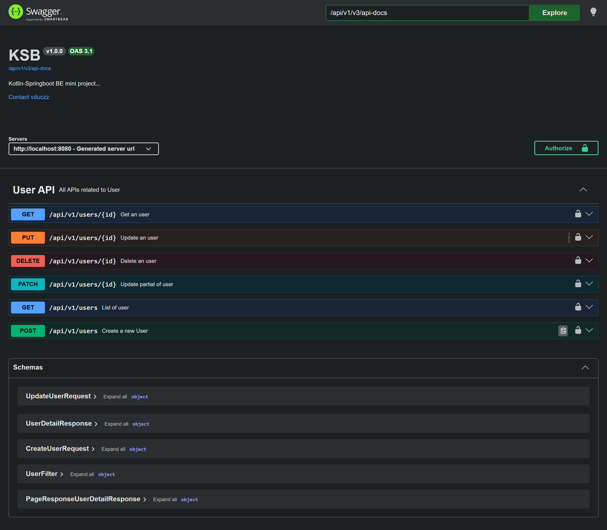

# Swagger

> _`Swagger` (**OpenAPI**) giúp **show** + **cho phép test** các `project's API`_

### **1. Depedencies**

- **Spring Boot 2.x**: `springfox-swagger2`
- **Spring Boot > 3.x**: `springdoc-openapi`

details: [build.gradle.kts](/codes/mini-project/build.gradle.kts)

### **2. Configuration**

details: [config/OpenAPIConfig.kt](/codes/mini-project/src/main/kotlin/com/vduczz/mini_project/config/OpenApiConfig.kt)

### **3. `controller`**:

details: [UserController.kt](/codes/mini-project/src/main/kotlin/com/vduczz/mini_project/controller/UserController.kt)

### **Run server and goto: [http://localhost:8080/swagger-ui.html](http://localhost:8080/swagger-ui.html)**
example result: 
