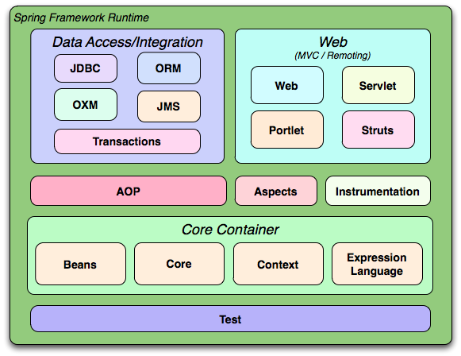

# Spring Framework Architecture

1. [`Core Container`](./CoreContainer.md) layer
2. AOP - Aspect-Oriented Programming layer -> tương tự nhưng cao cấp hơn Middleware
3. `Data Access / Integration` layer:
   - `spring-jdbc`: hỗ trợ code kết nối DB thay vì phải viết lặp lại
   - `spring-orm`: tích hợp ORM framwork như `Hibernate` (JPA) giúp IoC quản lý vòng đời các kết nối DB
   - `spring-tx`: Transaction Management -> quản lý transaction -> Rollback, Commit, .... bằng cách sử dụng `@Transaction`
4. `Web / MVC` layer -> xử lý HTTP request
   - `spring-web`: cung cấp các tính năng web cơ bản như IoC container bằng Servlet listener, upload file multipart, ...
   - `spring-webmvc`: chứa mô hình Model-View-Controller và xử lý RESTful API ( `@RestController`, `@RequestMapping`, ...)
5. Test layer -> Unit Test (JUnit) / Integration Test

---

## **Contact**

**[LinkedIn](https://www.linkedin.com/in/duc-pham-b19b66351/)  
[Mail](mailto:ducpv.contact@gmail.com)  
[Instagram](https://www.instagram.com/vduczz/)**

---

#vduczz
