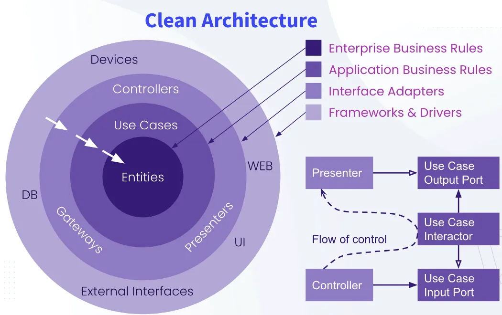

# **_Clean_** Architecture + _**Domain-Driven Design**_



**`Dependency Rule`**: Quy tắc **phụ thuộc hướng nội** => `business-core` không quan tâm (không được biết) gì về `database`, `ui`, `framkework`

> _Cụ thể, `source-code` **chỉ được phép trỏ từ ngoài vào trong**_

---

## **1. _Components_**

1. **`Entities`** - **Enterprise Business Rules** - lõi trung tâm: chứa `core business logics`, _ít bị thay đổi_

   Trong **DDD**, `Entities` là `Domain`, nơi chứa:
   - `Aggregate Root`: là `model`, chứa **data** & các **hàm xử lý logic** của chính nó.
   - `Value object`: model's components, ex: Address component (object) in User model
   - `Domain Event`

   > _**Entities Round** là code thuần túy nhất, được viết bằng Java, C#, Go, ... thực thi các **logic nghiệp vụ cốt lõi** của hệ thống, mà không cần biết (phụ thuộc) UI gì?, DB nào? , web framework gì?, ..._

2. **`Use Case`** - **Application Business Rules** - lớp ứng dụng: chứa kịch bản cụ thể của hệ thống, ex: _cho khách hàng đặt phòng(BookingUseCase)_,... **Use Case** đóng vai trò là `Orchestrator` - **Điều phối** - thay vì đảm nhiệm toàn bộ `business-logic` của hệ thống.

   Trong **DDD**, **Use Case** tương đương với **Application Service**, nhận request từ vòng ngoài và gọi `Entities` để thực thi logic, lưu kết quả, ... sau đó phản hồi.

3. **`Interface Adapter`**: có nhiệm vụ:
   - Làm `bộ chuyển đổi giao tiếp` / `phiên dịch` **HTTP Request** thành format mà **UseCase** có thể hiểu.
   - Ở chiều ngược lại, **Interface Adapter** lấy dữ liệu từ **UseCase**, chuyển thành `JSON` để trả về client hoặc chuyển thành `SQL Commands` để lưu DB.

     **Components**:

   - `Controller`: Web -> Nhận JSON từ HTTP Request, bóc tách và đưa vào format mà Usecase hiểu
   - `Presenter`: UI -> Nhận data từ UseCase, format lại và hiển thị,... **Nhiệm vụ chính là format response**
   - `Gateway`/`Adapter`: interacts with DB, external APIs,..

4. **`Framework`** & **`Drivers`**:

   Đây là lớp áp dụng các **`specific-technologies`** của: **Web Framework** (_SpringBoot_, ...), **Database** (_MySQL_, _Postgres_, ...), **Message Broker** (_Kafka_, ...), **Mail Sender**, ...

   Code ở phần này chủ yếu là file **`config`** hoặc **`setup`**

## **2. Clean Project structure _without DDD_**

```plaintext
src/main/java/com/example/smartlock/
    ├── core/
    │   ├── entities/                       // chứa data và validation nhẹ
    │   │   └── SmartLock.java
    │   └── usecases/                       // logic điều phối
    │       ├── UnlockDeviceUseCase.java    // interface
    │       └── UnlockDeviceInteractor.java // usecase implements
    │
    ├── dataproviders/                      //Interface Adapters & Frameworks (Data)
    │   ├── database/
    │   │   ├── LockRepositoryImpl.java     // interact w DB
    │   │   └── LockJpaEntity.java          // Entity -> DB Table
    │   └── network/
    │       └── IoTGatewayImpl.java         //
    └── entrypoints/                        // giao tiếp client
        └── web/
            ├── LockController.java         // Hứng API
            └── UnlockRequest.java          // DTO
```

## **3. Clean Project structure _with DDD_**

```plaintext
src/main/java/com/example/smartlock/
    │
    ├── domain/                              // core business logic
    │   ├── model/
    │   │   ├── SmartLock.java               // Aggregate Root -> data + business logic
    │   │   ├── LockStatus.java              // Enum/Value Object
    │   └── exception/
    │       └── LockJammedException.java     // Business Exception
    │
    ├── application/                         // USE CASES
    │   ├── port/                            // cổng giao tiếp
    │   │   ├── in/                          // request in -> invoked by controller
    │   │   │   └── UnlockDeviceUseCase.java // Interface: định nghĩa hàm unlock()
    │   │   └── out/                         // take data from out -> request data from DB/External API
    │   │       ├── LoadLockPort.java        // Interface lấy ổ khóa (thay cho Repository)
    │   │       └── SaveLockPort.java        // Interface lưu trạng thái
    │   │
    │   └── service/
    │   │   └── UnlockDeviceService.java     // implements 
    │   │
    │   └── model/                           // Response Model
    UnlockDeviceUseCase. Gọi Port Out để lấy/lưu data.
    │
    ├── adapter/                             // ADAPTERS
    │   ├── in/                              // input -> receive requests from client
    │   │   └── web/
    │   │       ├── LockController.java      // REST API, invokes UnlockDeviceUseCase (Port In)
    │   │       └── dto/
    │   │           └── UnlockRequest.java
    │   │
    │   └── out/                             // out -> DB/...
    │       ├── persistence/                 // DB Adapter
    │       │   ├── LockPersistenceAdapter.java // implements `application/out/...` ( LoadLockPort & SaveLockPort )
    │       │   ├── entity/
    │       │   │   └── LockJpaEntity.java   // DB Entity -> @Entity, @Table
    │       │   ├── mapper/
    │       │   │   └── LockMapper.java      // Domain Model - Entity Mapper
    │       │   └── repository/
    │       │       └── SpringDataLockRepo.java // ORM,.. ex: JpaRepository (LockRepository..)
    │       │
    │       └── iot/                         // Hardware Adapter
    │           └── MqttAdapter.java         // Bắn tín hiệu MQTT mở khóa vật lý
    │
    └── infrastructure/                      // CẤU HÌNH (Khởi động hệ thống)
        └── config/
            ├── BeanConfig.java              // @Bean (inject) Adapter vào Service
            └── SecurityConfig.java          // Web Security
```

**Data flow**: `controller`-`service`-`presenter`

- client sends request to `controller`
- `controller` call `service`
- `service` return data to `controller`
- `controller` call `presenter` to process data
- `presenter` return to `controller`
- `controller` responses to client
