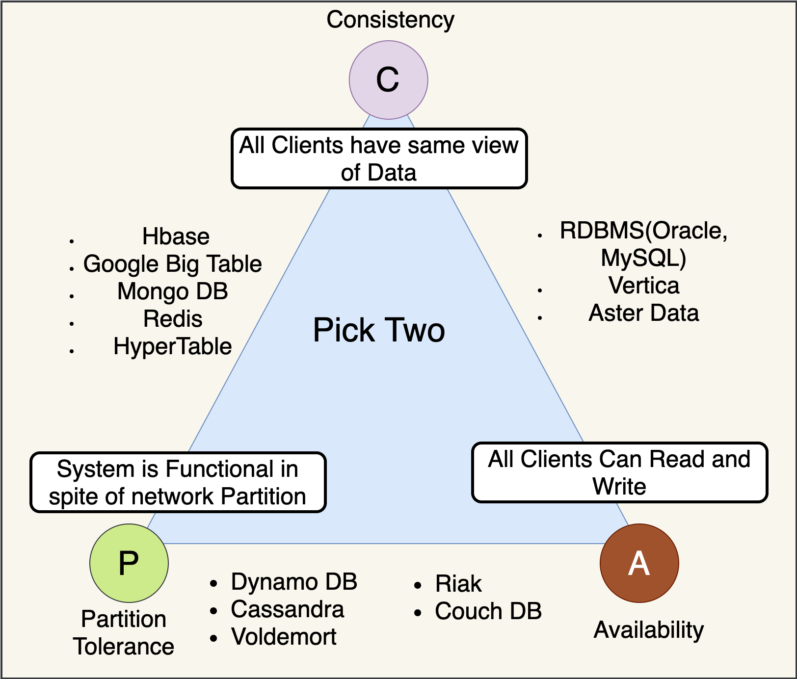

# **`CAP` Theorem**

## **`1.` `CAP` Theorem (Định lí)**

**`CAP` Theorem**: Trong `distributed system`, không thể **ĐỒNG THỜI** đảm bảo cả 3 thuộc tính: `Consistency`, `Availability`, `Partition tolerance`. Khi có `network partition` (**đứt mạng**, luôn xảy ra trong thực tế), buộc phải **chọn C hoặc A**.

> _Máy chủ ảo trên Cloud, đường truyền mạng internet... đéo có gì đảm bảo 100% không rớt gói tin_

---

## **`2.` `CAP` Triangle**

### **`C` - Consistency: Tính `nhất quán`**

**`C`onsitency**: **Mọi `node`** trả về cùng **một dữ liệu** tại **cùng thời điểm**. Đọc từ bất kỳ node nào cũng thấy **write mới nhất**.

> _**Ex**: Sau khi chuyển tiền, số dư mọi node phải phản ánh ngay._

### **`A` - Availability: Tính `sẵn sàng`**

**`A`vailability**: Mọi request **đều nhận được response** - hệ thống lúc nào cũng phải trả lời user (`HTTP 200`), **không** được phép timeout hay văng lỗi `500/503` - **dù một số `node bị down`**.

> _**Ex**: Luôn trả về kết quả tìm kiếm, dù có thể hơi cũ._

### **`P` - Partition tolerance: Khả năng chịu `chia cắt mạng`**

**`P`artition tolerance**: Hệ thống tiếp tục hoạt động dù mạng bị phân tách (nodes không liên lạc được với nhau)

> _**Ex**: server Hà Nội không gọi được cho server HCM, hệ thống tổng thể vẫn phải tiếp tục hoạt động chứ không được sập toàn tập._

### **Thực tế**: `P` **luôn phải chọn** — `network fail` là **tất yếu**.

---

## **`3.` `AP` or `CP`**

> _Vì **`P` luôn phải chọn**, câu hỏi thực tế chỉ là: **`CP` hay `AP`** — chọn `Consistency` hay `Availability` khi network partition xảy ra?_

|              | `CP`                                                                                                                                                               | `AP`                                                                                                                                               |
| :----------- | :----------------------------------------------------------------------------------------------------------------------------------------------------------------- | :------------------------------------------------------------------------------------------------------------------------------------------------- |
| **Ý tưởng**  | Thà **báo `lỗi`** còn hơn trả về **dữ liệu sai**                                                                                                                   | **Cứ phục vụ user đi**, `dữ liệu cũ` một tí cũng đéo chết ai, tí có mạng tao đồng bộ sau!                                                          |
| **Đặc điểm** | **Hi sinh `A`** để **bảo vệ `C`**.                                                                                                                                 | **Hi sinh `C`** để **bảo vệ `A`**                                                                                                                  |
| **Usecases** | `Payment`, `Account balance`, `Inventory` (số lượng chính xác), `Order` status — **bất cứ nơi nào** mà **dữ liệu sai** gây **hậu quả `tài chính` hoặc `pháp lý`**. | `Product catalog`, `User profile`, `Search index`, `Notification history`, `Analytics` — nơi mà **dữ liệu hơi cũ** vài giây là **chấp nhận được**. |
| **Return**   | Trả về mã lỗi `503` hoặc **Timeout**.                                                                                                                              | `Dữ liệu cũ` - **Eventual Consistency** (Nhất quán sau cùng)                                                                                       |
| **Ví dụ**    | - Hệ thống **Core Banking**  - Trừ tiền ví điện tử  - Đặt vé máy bay  - ...                                                                            | - Nút Like của Facebook  - Số lượng view của YouTube  - Giỏ hàng Shopee                                                                    |
| **Database** | `MongoDB`, `PostgreSQL`, `MySQL`, `Zookeeper`, ...                                                                                                                 | `Cassandra`, `DynamoDB`, `CouchDB`, `Redis`, ...                                                                                                   |

### **_Bẫy_ `CA`**:

> _`CA` CHỈ TỒN TẠI TRONG **ỨNG DỤNG NGUYÊN KHỐI** (`Monolithic`)_

Tức là ứng dụng chỉ có `đúng 1 con server`, nối với đúng `1 Database` (như MySQL, PostgreSQL chạy **1 node duy nhất**). Vì tất cả **nằm chung 1 chỗ**, không có kết nối mạng nào để đứt (**Không có P**), nên nó **đạt được `CA`**.

Nhưng đổi lại, con server đó mà cháy mainboard thì hệ thống chết toàn tập.

---

## **`4.` Tăng _khả năng chịu lỗi_ của `server`**

**Bắt đầu với**: `Timeout` + `Retry` cho mọi external call. Thêm `Circuit Breaker` khi có **service hay `fail`**. Thêm `Bulkhead` khi một **service chậm ảnh hưởng toàn hệ thống**. `Rate Limiter` ở **API Gateway** để bảo vệ từ ngoài vào.

- **`CircuitBreaker` Pattern**: 3 trạng thái:
  - `CLOSED` (bình thường)
  - `OPEN` (ngắt, **fail fast**)
  - `HALF-OPEN` (thử lại).

  **Khi service B _liên tục fail_, đừng để A cứ _gọi và chờ timeout_ — ngắt mạch, trả `fallback` ngay**.

- **`Retry` + `Timeout` Pattern** — luôn đi cặp với nhau:
  - Retry không có Timeout = retry mãi mãi.
  - Timeout không có Retry = bỏ cuộc sau lỗi tạm thời.

  Dùng Exponential Backoff tránh Thundering Herd.

- **`Bulkhead` (+ `Rate Limiter`) Pattern**:
  - `Bulkhead`: cô lập thread pool theo từng `downstream service`. **PaymentService chậm không được phép kéo chết toàn bộ OrderService**.
  - `Rate Limiter`: bảo vệ service khỏi bị quá tải bởi quá nhiều request.

- **`Time Limiter` Pattern (optional)**: giới hạn thời gian chạy của toàn bộ 1 thao tác.

> `@Bulkhead` → `@TimeLimiter` → `@CircuitBreaker` → `@Retry`
