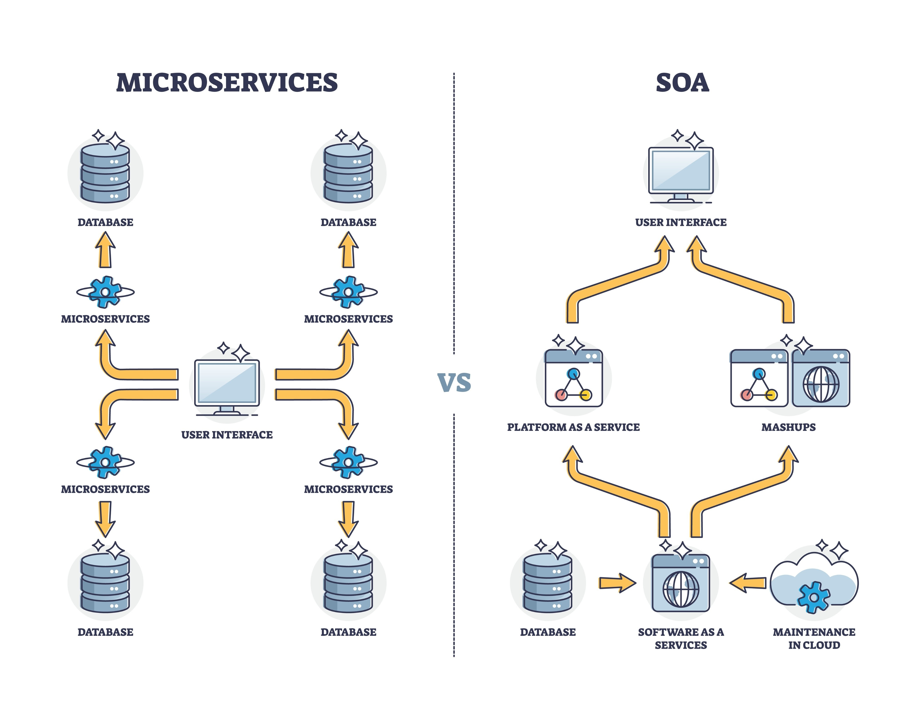

# _**Microservice**_ Architecture

`Microservices` = `Micro` + `Service`: **Phi dịch vụ** / Kiến trúc **hướng dịch vụ**

- **Monolithic** - Nguyên khối: Toàn bộ hệ thống được **build chung** thành 1 artifact duy nhất (`.jar` or `.war`) và **deloy chung**, chạy trên **một JVM process** duy nhất.
- **Microservices** - Hướng dịch vụ - `Service-Oriented Architecture`: hệ thống đựa tách thành các **services** nhỏ, độc lập với nhau.

Các **đặc tính** của kiến trúc `microservices`:

- **Independent Deployment & Scaling**: Mỗi service chạy trong một process hoặc container (Docker, ...) riêng biệt.

  Khi này, nếu cần `scale`,hoặc can thiệp vào service nào, ta chỉ cần deloy lại service đó thay vì phải deloy lại toàn bộ ứng dụng.

  Bên cạnh đó, việc **scale** ngang (thêm instance, ..) có thể thực hiện độc lập, chỉ thực hiện **scale riêng cho một vài services** thay vì phải scale toàn bộ dứng dụng (tốn tài nguyên cho các chức năng ít dùng, không cần scale).

- **Decentralized Data Management**: Áp dụng patter _`Database-per-service`_, mỗi service tự quản lý **DB**/**Schema** của riêng nó.

  Nhờ vậy, có thể loại bỏ hoàn toàn vấn đề **thắt cổ chai** ở tầng DB, ngăn chặn sự phụ thuộc dữ liệu (**data coupling**) và cho phép **sử dụng nhiều loại DBMS** khác nhau trong cùng 1 hệ thống - `Polyglot Persistence`

- **Inter-Process Communication (`IPC`)**: Không thể gọi trực tiếp như trong **Monolithic**, bắt buộc phải giao tiếp qua **network** bằng:
  - `Synchronous Protocol`: HTTP/REST, gRPC
  - `Asynchronous Protocol`: Message Broker (Kafka, RabbitMQ, ..)

- **High Cohesion & Loose Coupling**: Một service đóng gói **trọn vẹn một nghiệp vụ** (trong DDD gọi là **Bounded Context**). Sự thay đổi source code ở service này yêu cầu mức độ **thay đổi tối thiểu hoặc bằng không** ở các service khác

