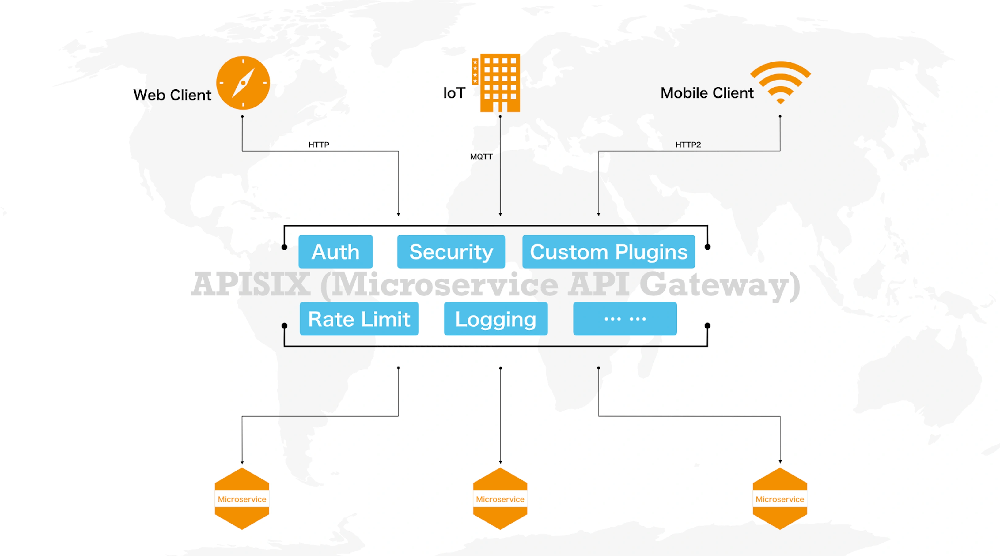
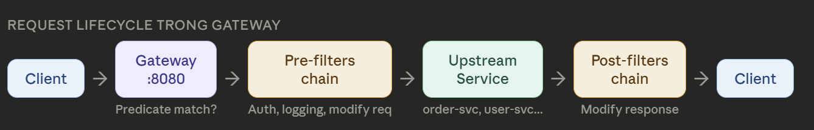
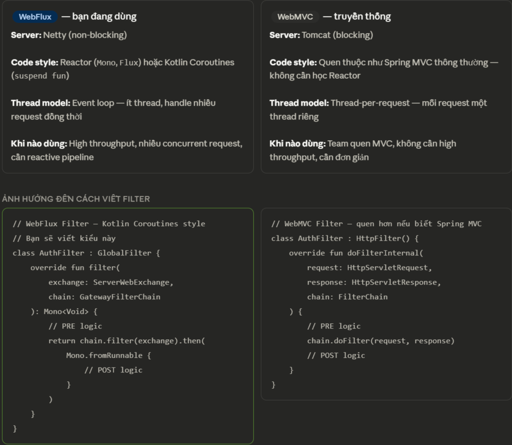

# **Spring Cloud _Gateway_**

Official Documents: [Spring Cloud Gateway](https://docs.spring.io/spring-cloud-gateway/docs/current/reference/html/)



## **`1.` `API` _Gateway_**

### **`1.1.` API Gateway**

> _**`API Gateway`** là **single entry point** - điểm vào duy nhất - của **toàn hệ thống**._

Client **không gọi trực tiếp** từng `service` — chỉ biết 1 địa chỉ duy nhất - **Gateway** - và **tất cả `request` phải đi qua `Gateway`**. Gateway xử lý:

- `routing`: gom đường dẫn
- `auth`: xác thực
- `rate limiting`: chống DDos
- logging
- circuit breaker
- ...

trước khi request tới được với services.

### **`1.2.` Request `Flow`**



```
Request đến
      ↓
Gateway Handler Mapping
  → tìm Route nào match request này?
  → dựa trên Predicates (Path, Method, Header...)
      ↓
Route tìm được
      ↓
Pre-filters chain
  → GlobalFilter 1 (Logging)
  → GlobalFilter 2 (Auth)
  → GatewayFilter (StripPrefix, AddHeader...)
      ↓
Proxied Request
  → forward đến service (lb://order-service)
  → Eureka resolve IP:port
  → gọi thực sự
      ↓
Post-filters chain (chạy sau khi nhận response)
  → thêm response header
  → log response time
      ↓
Response trả về client
```

### **`1.3.` Các vấn đề Gateway giải quyết**

- `Single entry point`: Client chỉ biết **một địa chỉ duy nhất**. Services có thể thay đổi IP/port tự do — Gateway che đi tất cả.
- `Cross-cutting concerns`: Auth, logging, rate limiting, CORS — những thứ **áp dụng cho tất cả services chỉ cần viết một lần ở Gateway**.
- `Protocol translation`: Client nói `REST`, service nói `gRPC`? **Gateway làm cầu nối**. Client không cần biết service dùng giao thức gì.
- `Load balancing`: Product Service chạy 3 instances? Gateway tự chia tải — client vẫn gọi một địa chỉ duy nhất.
- `Request aggregation`: Một request từ client → Gateway gọi nhiều services → gộp kết quả trả về. Giảm số lượng round-trip

---

## **`2.` Components**

### **`2.1.` _Routing_ - điều hướng `request`**

`Routing` là quá trình điều hướng request đến đúng service
dựa trên path, header, method, query param.

`Route` gồm 3 phần:

- `ID`: định danh
- `Predicate`: điều khiện khớp: **Predicate khớp** → request được **forward đến URI** đó.
- `URI`: điểm đích.
  - `uri: lb://order-service `: ← tìm "order-service" trong Eureka
  - `uri: http://order-service:8082`: ← gọi trực tiếp, không qua Eureka
  - `uri: forward:/fallback/orders`: ← forward nội bộ trong gateway
- `Filters`

### **`2.2.` _Pedicates_ - Match condition**

**Pedicates _Types_**:

- `Path`: `Path=/api/v1/orders/**`: khớp URL path, hỗ trợ wildcard `**` và `{param}`
  - `**`: bất kì sub-path nào
  - `*`: 1 segment
- `Method`: `Method=GET,POST` — chỉ cho phép HTTP method cụ thể
- `Header`: `Header=X-Version, v2` — khớp header (có header `X-Version`) và giá trị (`v2` thường là regex)
- `Query`: `Query=version, v2` — khớp query parameter
- `Host`: `Host=**.myapp.com` — routing theo subdomain, dùng khi **Gateway** serve nhiều domain.
- `Weight`: `Weight=group1, 80` — canary deploy: 80% request trỏ về v1 (group1), 20% v2 -> **A/B testing**
- `RemoteAddr`: `RemoteAddr=192.168.1.0/24` -> match theo IP client -> giới hạn IP truy cập.
- `After`: `After=2025-01-01T00:00Z` -> match sau thời điểm này -> feature release theo schedule

### **`2.3.` _Filter_ - xử lý `request`/`response`**

Filter chạy trước (`pre`) và sau (`post`) khi **forward request**:

- **_Previous_ filter**: `auth`, `add header`, `rate limit`.
- **_Post_ filter**: add `CORS` header, `log` response time, transform response body.

**Popular `built-in` filters**

| Filter                 |                                      Meaning                                      |                       Example                       |
| :--------------------- | :-------------------------------------------------------------------------------: | :-------------------------------------------------: |
| **StripPrefix**        |                            Xóa N segment đầu của path.                            | `StripPrefix=1`: `/api/orders/123` → `/orders/123`. |
| **AddRequestHeader**   |                     Thêm header vào request trước khi forward                     |  `AddRequestHeader=X-Gateway-Source, coffee-shop`   |
| **AddResponseHeader**  |                  Thêm header vào response trước khi trả client.                   |              `AddResponseHeader=K, V`               |
| **RewritePath**        |             Rewrite URL bằng `regex`. Linh hoạt hơn **StripPrefix**.              |      `RewritePath=/api/(?<seg>.\*), /$\{seg}`       |
| **RequestRateLimiter** |             Rate limit dùng Redis token bucket. Cần Redis dependency.             |                                                     |
| **CircuitBreaker**     |     Tích hợp Resilience4j — ngắt mạch nếu service downstream fail quá nhiều.      |                                                     |
| **Retry**              | Retry request khi service trả về lỗi 5xx. Config số lần retry, method được retry. |                                                     |

### **`2.4.` Auth & Security**

Xác thực `JWT` **một lần tại Gateway** — các service bên trong tin tưởng Gateway đã verify rồi, chỉ cần đọc header X-User-Id. Không cần mỗi service tự verify JWT.

Thường sử dụng `OAuth2`.

**Auth `ở đâu`?**

- **`Service` tự verify**:
  - Mỗi service tự đọc JWT, tự verify.
  - **Vấn đề**: duplicate code, JWT library ở mọi service, một service quên verify là lỗ hổng bảo mật.
- **`Gateway` verify**:
  - Gateway verify JWT, forward kết quả qua header. Service chỉ đọc header — không cần biết JWT.
- **`AuthService` riêng**:
  - Gateway gọi Auth Service để verify.
  - **Auth Service** là **`source of truth`**.
  - **Phức tạp hơn, phù hợp hệ thống lớn có nhiều loại auth.**

### **`2.5.` Rate Limiter**

`Rate Limiter` tại Gateway ngăn một client gửi quá nhiều request, bảo vệ tất cả services phía sau. Dùng Redis để lưu counter — hoạt động đúng khi chạy nhiều Gateway instance.

### **`2.6.` Circuit Breaker**

Khi **`service` downstream down**, thay vì trả 503 về client, Gateway có thể trả về response dự phòng (`fallback`) — trang thông báo lỗi thân thiện, cached data, hoặc default response.

### **`2.7.` `WebFlux` vs `WebMVC`**

## 

## **`2.` Implementations: [Setup API Gateway](./SetupApiGateway.md)**
