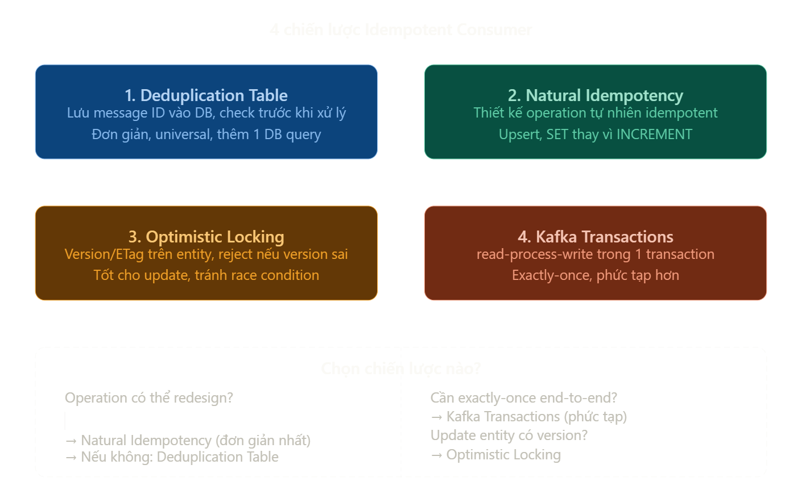
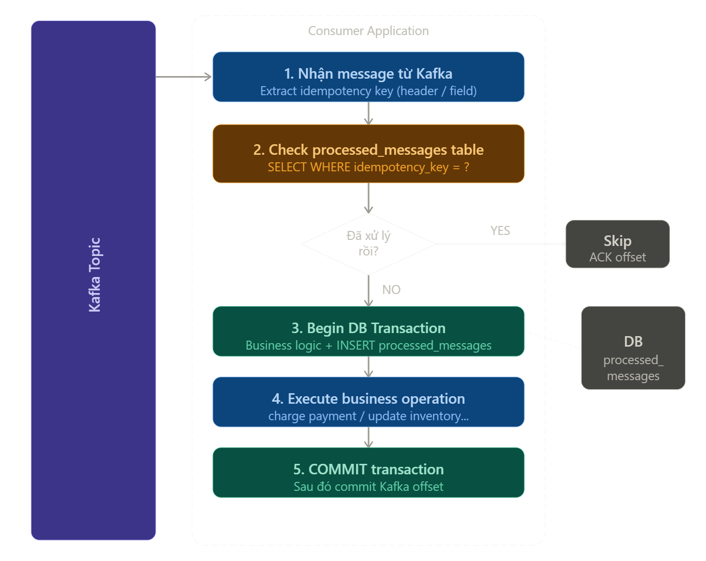

# **_Itempotent_ Consumer - `Dedup Table`**

## **`1.` Các chiến lược _triển khai_ `Idempotent Consumer`**



## **`2.` `Deduplication` Table flow**



## **`3.` Triển khai**

### **`3.1.` Idempotency**: [Schema](#schema), [Entity](#entity), [Repository](#repository), [Service](#service)

Tương tự `Outbox Pattern`, `Dedup Table` cũng cần một nơi để lưu các **message đã xử lý**.

#### `Schema`

```sql
-- Schema: lưu các message đã xử lý
-- Bảng lưu trữ các message đã xử lý
CREATE TABLE processed_messages (
    id              BIGSERIAL PRIMARY KEY,

    -- idemtency_key -> check message is proccessed?
    idempotency_key VARCHAR(255) NOT NULL,

    -- phân biệt giữa các services nếu:
    -- service có nhiều service nhỏ bên trong,
    -- và nhiều service nhỏ cùng lắng nghe 1 loại message
    consumer_group  VARCHAR(255) NOT NULL,

    -- topic, partition_num, offset -> phục vụ observability & debugging
    -- ex: payment này được trigger bởi Kafka message offset 12345, partition 2
    topic           VARCHAR(255) NOT NULL,
    partition_num   INTEGER      NOT NULL,
    kafka_offset    BIGINT       NOT NULL,

    -- payload (optional) -> verify payload
    payload_hash    VARCHAR(64),

    -- timestamp nhận message và xử lý thành công thực tế
    processed_at    TIMESTAMP    NOT NULL DEFAULT NOW(),

    -- TTL phục vụ cleanup job
    expires_at      TIMESTAMP    NOT NULL,

    CONSTRAINT uq_idempotency UNIQUE (idempotency_key, consumer_group)
);

-- Index -> tăng tốc query
CREATE INDEX idx_processed_key ON processed_messages(idempotency_key, consumer_group);
CREATE INDEX idx_expires_at     ON processed_messages(expires_at);  -- cho cleanup job
```

Schema đơn giản hơn nên chứa các thông tin tối thiểu:

```sql
CREATE TABLE processed_messages (
    idempotency_key VARCHAR(255) NOT NULL,
    consumer_group  VARCHAR(255) NOT NULL,
    expires_at      TIMESTAMP    NOT NULL,
    PRIMARY KEY (idempotency_key, consumer_group)
);
```

#### `Entity`

```java
// ProcessedMessage.java
@Entity
@Table(name = "processed_messages")
@Getter @Setter
public class ProcessedMessage {

    @Id @GeneratedValue(strategy = GenerationType.IDENTITY)
    private Long id;

    @Column(name = "idempotency_key", nullable = false)
    private String idempotencyKey;

    @Column(name = "consumer_group", nullable = false)
    private String consumerGroup;

    private String topic;

    @Column(name = "partition_num")
    private Integer partition;

    @Column(name = "kafka_offset")
    private Long offset;

    @Column(name = "processed_at")
    private LocalDateTime processedAt;

    @Column(name = "expires_at")
    private LocalDateTime expiresAt;

    public static ProcessedMessage of(
            String key, String group,
            String topic, int partition, long offset,
            Duration ttl) {
        var msg = new ProcessedMessage();
        msg.idempotencyKey = key;
        msg.consumerGroup  = group;
        msg.topic          = topic;
        msg.partition      = partition;
        msg.offset         = offset;
        msg.processedAt    = LocalDateTime.now();
        msg.expiresAt      = LocalDateTime.now().plus(ttl);
        return msg;
    }
}
```

#### `Repository`

```java
// ProcessedMessageRepository.java
@Repository
public interface ProcessedMessageRepository
        extends JpaRepository<ProcessedMessage, Long> {

    // check message is processed by this consumerGroup
    boolean existsByIdempotencyKeyAndConsumerGroup(
            String idempotencyKey, String consumerGroup);

    // Cleanup expired records
    @Modifying
    @Query("DELETE FROM ProcessedMessage p WHERE p.expiresAt < :now")
    int deleteExpired(@Param("now") LocalDateTime now);
}
```

#### `Service`

```java
@Service
@RequiredArgsConstructor
@Slf4j
public class IdempotencyService {

    private final ProcessedMessageRepository repository;
    private static final String CONSUMER_GROUP = "payment-service";
    private static final Duration TTL = Duration.ofDays(7);

    // Không có @Transactional — transaction do ProcessingOrchestrator quản lý
    public boolean tryMark(ConsumerRecord<?, ?> record, String idempotencyKey) {
        try {
            var msg = ProcessedMessage.of(
                    idempotencyKey, CONSUMER_GROUP,
                    record.topic(), record.partition(), record.offset(),
                    TTL
            );
            repository.saveAndFlush(msg); // flush ngay để trigger UNIQUE constraint
            return true;

        } catch (DataIntegrityViolationException ex) {
            // UNIQUE constraint bắt được race condition
            log.warn("Duplicate via constraint. key={}", idempotencyKey);
            return false;
        }
    }

    // Dùng cho pre-check nhanh TRƯỚC khi mở transaction
    public boolean alreadyProcessed(String idempotencyKey) {
        return repository.existsByIdempotencyKeyAndConsumerGroup(
                idempotencyKey, CONSUMER_GROUP);
    }
}
```

---

### **`3.2.` _Consumer_ Configuration**

#### **`application.yml`**

```yml
spring:
  kafka:
    bootstrap-servers: ${KAFKA_BROKERS:localhost:9092}

    producer:
      key-serializer: org.apache.kafka.common.serialization.StringSerializer
      value-serializer: org.springframework.kafka.support.serializer.JsonSerializer
      acks: all
      retries: 2147483647
      properties:
        # + PID được cấp cố định trong 1 lần start server
        # + sequence: thứ tự của message được quản lí bởi producer(mỗi partition có sequence riêng biệt, tự tăng khi produce gửi thành công)
        # => enable.idempotence: true => broker sử dụng (PID, sequence_numer) để check duplicate message hoặc message nhảy cóc thứ tự
        enable.idempotence: true #

        # tối đa 5 batch có thể được gửi đi mà không cần chờ ack
        # Giống như gửi 5 email mà không cần chờ người kia reply từng cái
        # nhưng nếu đã có 5 email chưa được reply thì phải chờ.
        max.in.flight.requests.per.connection: 5
        linger.ms: 5 # chờ tối đa 5ms để gom thêm message vào batch
        batch.size: 16384 # kích thước tối đa 1 batch (bytes)

    consumer:
      group-id: payment-service
      auto-offset-reset: earliest

      # enable-auto-commit: mặc định, kafka commit offset theo định kì (mỗi 5s)
      # việc set false giúp chủ động trong việc commit offset
      # kết hợp với  "ack-mode: record"  -> commit nếu @KafkaListener thực hiện thành công
      enable-auto-commit: false

      # isolation-level: liên quan tới Kafka Transaction
      # khi producer dùng  "enable.idempotence: true" hoặc Transaction API
      # -> có thể đang write nhiều message vào nhiều partition trong một transaction, nhưng chưa commit xong
      # isolation-level: read_committed (default) => chỉ đọc những message đã được producer commit
      isolation-level: read_committed

      # max-poll-records: Kafka consumer hoạt động theo vòng lặp poll, mỗi lần lấy N record về và xử lý từng cái
      # Kafka không biết consumer xử lý tới đâu trong batch, chỉ biết consumer có còn đang hoạt động hay không qua heartbeat
      # "max.poll.interval.ms" (default 5):  -> nếu sau 5p không gọi poll(), kafka coi consumer đã chết
      # => nếu đặt "max-poll-records" quá cao => có thể xử lý lâu và không kịp poll()
      # => cần đặt số record lấy về xử lý mỗi lần hợp lý
      max-poll-records: 10

      key-deserializer: org.apache.kafka.common.serialization.StringDeserializer
      value-deserializer: org.springframework.kafka.support.serializer.JsonDeserializer
      properties:
        spring.json.trusted.packages: "com.example.events"
        max.poll.interval.ms: 300000 # 300ms gọi poll() 1 lần.

    listener:
      ack-mode: record # AckMode.RECORD — không cần Java code!
      missing-topics-fatal: false # consumer không crash khi subcribe topic chưa được tạo
```

#### Config behavior:

```java
@Configuration
@RequiredArgsConstructor
public class KafkaConfig {

    private final KafkaProperties kafkaProperties;
    private final KafkaTemplate<String, Object> kafkaTemplate;

    // ErrorHandler
    @Bean
    public DefaultErrorHandler errorHandler() {
        // cho phép retry tối đa 3 lần
        var backoff = new ExponentialBackOffWithMaxRetries(3);
        // lần đầu thất bại =>  chờ 1s để retry lần tiếp theo
        // các lần sau x2 lần trước đó, tối đa chờ 10s
        backoff.setInitialInterval(1_000L);
        backoff.setMultiplier(2.0);
        backoff.setMaxInterval(10_000L);

        var handler = new DefaultErrorHandler(
                // hết retry -> đẩy vào DLT
                // DTL được tạo tự động: topic_gôc.dlt
                new DeadLetterPublishingRecoverer(kafkaTemplate),
                backoff
        );

        // một số lỗi không cần retry mà đẩy luôn vào dlt
        handler.addNotRetryableExceptions(
                // không retry với lỗi parse JSON lỗi
                DeserializationException.class,
                MessageConversionException.class,   // không convert được type
                MethodArgumentNotValidException.class // validation fail
        );
        return handler;
    }

    // gắn ErrorHandler vào ListenerContainerFactory
    @Bean
    public ConcurrentKafkaListenerContainerFactory<String, Object>
            kafkaListenerContainerFactory(
                ConsumerFactory<String, Object> consumerFactory // inject bean Spring Boot đã tạo
            ) {
        var factory = new ConcurrentKafkaListenerContainerFactory<>();
        factory.setConsumerFactory(consumerFactory);  // dùng lại, không tự tạo
        factory.setCommonErrorHandler(errorHandler());
        return factory;
    }
}
```

---

### **`3.3.` _Header_ `Idempotency Key`**: [Producer](#producer)

#### **Producer**

Ngoài `event-type`, producer cần gắn thêm `idempotency-key` vào `header` của message.

```java
headers.add("idempotency-key",
                event.getOrderId().getBytes(StandardCharsets.UTF_8));

var record = new ProducerRecord<>(
                TOPIC, null,
                event.getOrderId(), // message-key -> phục vụ partitioning
                event,
                headers // gắn header vào record
            );

kafkaTemplate.send(record).whenComplete(...)
```

### **`3.4.` _Consume_ message**

#### **`Business Service`**

```java
@Component
@RequiredArgsConstructor
@Slf4j
public class ProcessingOrchestrator { // ProcessingService

    private final IdempotencyService idempotencyService;
    private final PaymentService     paymentService;

    @Transactional  // 1 transaction bao phủ CẢ HAI operation
    public ProcessResult process(
            ConsumerRecord<String, OrderEvent> record,
            String idempotencyKey) {

        // Check lần 2 trong transaction — chống race condition
        // (2 consumer cùng vượt qua pre-check đồng thời)
        boolean marked = idempotencyService.tryMark(record, idempotencyKey);
        if (!marked) {
            return ProcessResult.DUPLICATE;
        }

        // Business logic nằm trong CÙNG transaction với INSERT trên
        // Nếu dòng này throw → cả INSERT lẫn business đều rollback
        paymentService.processPayment(record.value());

        return ProcessResult.SUCCESS;
        // Method return → Spring commit transaction
        // INSERT processed_messages + payment commit cùng lúc
    }

    public enum ProcessResult {
        SUCCESS, DUPLICATE
    }
}
```

#### **`Consumer` (Listener)**

```java
// PaymentEventConsumer.java
@Component
@RequiredArgsConstructor
@Slf4j
public class PaymentEventConsumer {

    private final ProcessingOrchestrator orchestrator;
    private final IdempotencyService     idempotencyService;

    @KafkaListener(
        topics           = "orders",
        groupId          = "payment-service",
        containerFactory = "kafkaListenerContainerFactory"
    )
    public void consume(ConsumerRecord<String, OrderEvent> record) {
        String key = extractIdempotencyKey(record);

        log.info("Received message key={} topic={} partition={} offset={}",
                key, record.topic(), record.partition(), record.offset());

        // Pre-check NGOÀI transaction — tránh mở TX rồi mới biết là duplicate
        // Không phải guardrail chính (race condition vẫn có thể qua được)
        // Guardrail chính là UNIQUE constraint trong tryMark()
        if (idempotencyService.alreadyProcessed(key)) {
            log.info("Pre-check: already processed, skipping. key={}", key);
            return;
        }

        // ProcessingOrchestrator là bean riêng → Spring AOP tạo proxy được
        // → @Transactional hoạt động đúng
        ProcessResult result = orchestrator.process(record, key);

        switch (result) {
            case SUCCESS  -> log.info("Processed successfully. key={}", key);
            case DUPLICATE -> log.info("Duplicate caught in TX. key={}", key);
        }
        // Không cần xử lý exception ở đây
        // Nếu orchestrator.process() throw → Spring Kafka tự retry
    }

    private String extractIdempotencyKey(ConsumerRecord<String, OrderEvent> record) {
        Header header = record.headers().lastHeader("idempotency-key");
        if (header != null) {
            return new String(header.value(), StandardCharsets.UTF_8);
        }
        return "order:" + record.value().getOrderId();
    }
}
```

### **`3.5.` Cleanup Job**

```java
// ProcessedMessageCleanupJob.java
@Component
@RequiredArgsConstructor
@Slf4j
public class ProcessedMessageCleanupJob {

    private final ProcessedMessageRepository repository;

    // Chạy mỗi ngày lúc 2 AM
    @Scheduled(cron = "0 0 2 * * *")
    @Transactional
    public void cleanup() {
        int deleted = repository.deleteExpired(LocalDateTime.now());
        log.info("Cleaned up {} expired processed_messages records", deleted);
    }
}
```
