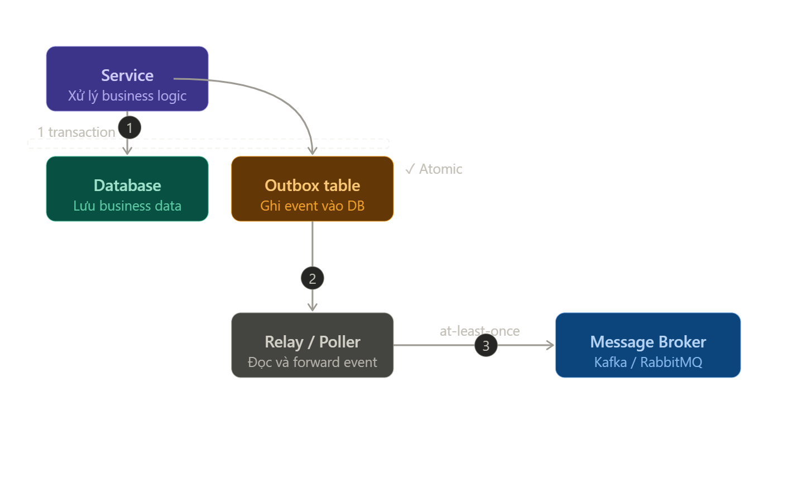

# **`Asynchronous` Communicate _advanced_**

## **`1.` Transactional Outbox pattern**

### **Problem**:

Phía `producer` thực hiện **lưu DB thành công** nhưng quá trình **gửi message** vào broker gặp **thất bại**, khi này:

- Producer được cập nhật dữ liệu
- Consumer không nhận được event -> không được cập nhật.

**Hậu quả**: Hệ thống không đồng bộ dữ liệu.

### **Solution: `at-least-one` delivery**

`Transactional Outbox Pattern`: thay vì cố gắng thực hiện 2 thao tác không thể **atomic**:

- Save DB
- Publish message

thì ta thực hiện: **lưu event vào DB trong cùng transaction với thao tác lưu DB**. Một process riêng sẽ đọc và relay lên broker sau.

**`Notes`**:

- Không nên xử lý **Transactional Outbox Pattern** cho toàn bộ events. Chỉ nên dùng `Outbox` khi **_`event liên quan tới dữ liệu quan trọng và phải đảm bảo consistency`_** như `UserCreated`, `PaymentCompleted`, `OrderPlaced`, ...
- Không cần outbox nếu event **không critical** hoặc **có thể retry / regenerate**, ví dụ: `SendWelcomeEmail`, `UpdateSearchIndex`, `AnalyticsEvent`, ...
- **Transactional Outbox Pattern** là ý tưởng, nên triển khai ở `Kafka`/`RabbitMQ` hay bất kì message queue nào là tương tự nhau.

### **Triển khai [Transactional Outbox Pattern](./TransactionalOutboxPattern.md)**

---

## **`2.` _Idempotent_ Consumer**

Trong hệ thống phân tán, message broker đảm bảo `at-least-one` deliver, tức là message có thể được gửi **nhiều hơn 1 lần**:

- Do consumer **xử lý thành công**, nhưng `crash` ngay **trước khi commit offset**.
- Network partition khiến broker **không** nhận được `ACK`.
- Consumer rebalance
- Retry logic trong producer.

Nếu xử lý message **không idempotent** có thể dẫn tới các vấn đề: `double-charge`, `duplicate-record`, `wrong inventory cound`, ...

**`Idempotent Consumer`** là **pattern** đảm bảo dù **nhận một message N lần** thì kết quả cuối cùng vẫn **như xử lý đúng 1 lần**.

#### **Triển khai: [Dedup Table](./IdempotentConsumer.md)**

Tương tự **Outbox pattern**, không phải event nào cũng cần cơ chế **Idempotent Consumer**.

---

##
