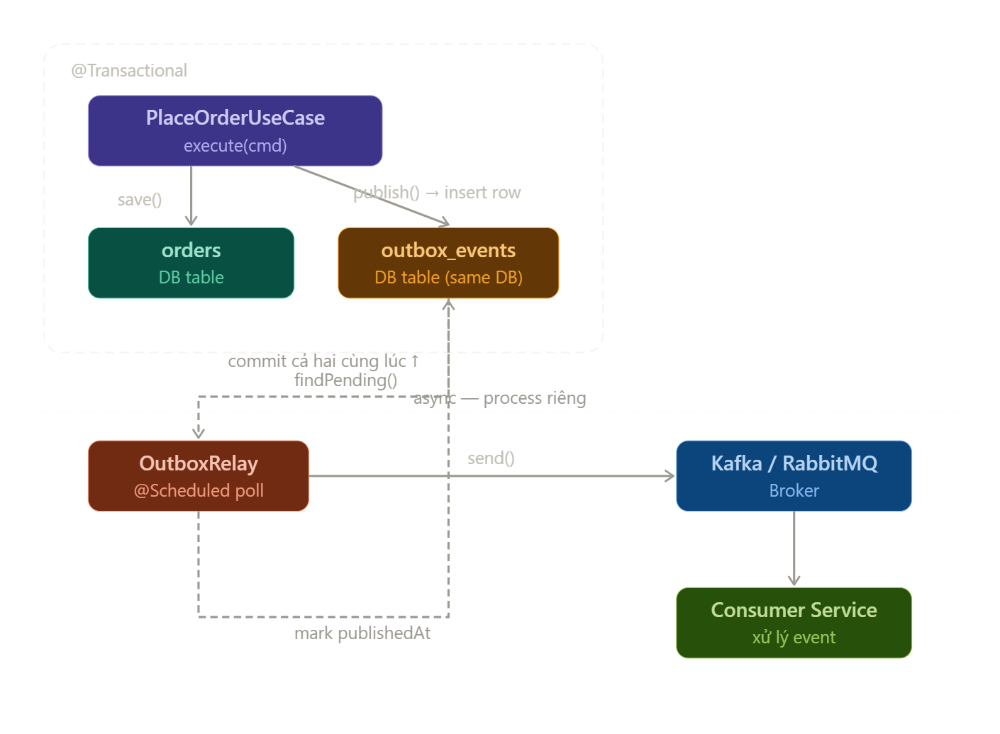

# _**Transactional `Outbox` Pattern**_



## `OutboxEvent` **entity**

```java
@Entity
@Table(
        name = "outbox_events",
        indexes = {
                @Index(name = "idx_kafka_aggregate", columnList = "aggregate_type, aggregate_id"),
                @Index(name = "idx_kafka_event_status", columnList = "status, published_at, occurred_at")
        }
)
@Getter
@NoArgsConstructor(access = AccessLevel.PROTECTED)
public class OutboxEvent {
    @Id
    @Column(columnDefinition = "CHAR(36)")
    @JdbcTypeCode(SqlTypes.CHAR)
    private UUID id;

    @Column(name = "aggregate_id", columnDefinition = "CHAR(36)", nullable = false)
    @JdbcTypeCode(SqlTypes.CHAR)
    private UUID aggregateId;
    @Column(nullable = false, name = "aggregate_type")
    private String aggregateType;

    @Column(nullable = false)
    private String topic;

    @Column(name = "event_type", nullable = false)
    private String eventType; // consumer dựa vào event-type để resolve

    @Column(nullable = false, columnDefinition = "JSON")
    private String payload;

    @Column(name = "occurred_at", nullable = false)
    private Instant occurredAt;

    @Column(name = "published_at")
    private Instant publishedAt;

    @Column(nullable = false)
    @Enumerated(EnumType.STRING)
    private EventStatus status;

    public static OutboxEvent create(
            AggregateRoot aggregateRoot,
            KafkaEventDestination destination,
            String payload
    ) {
        OutboxEvent entity = new OutboxEvent();
        // Outbox entity information
        entity.id = UUID.randomUUID();
        entity.occurredAt = Instant.now();
        entity.publishedAt = null;
        entity.status = EventStatus.PENDING;

        // AggregateRoot information
        entity.aggregateId = aggregateRoot.getAggregateId();
        entity.aggregateType = aggregateRoot.getAggregateType();

        // Kafka Topic information
        entity.topic = destination.topic();

        // Message information
        entity.eventType = destination.typeId();
        entity.payload = payload;

        return entity;
    }

    public boolean isPending() {
        return this.status == EventStatus.PENDING;
    }

    public void markPublished() {
        this.status = EventStatus.PUBLISHED;
        this.publishedAt = Instant.now();
    }

    public void markFailed() {
        this.status = EventStatus.FAILED;
    }
}

```

## `OutboxRepository`

```java
@Repository
public interface OutboxRepository extends JpaRepository<OutboxEvent, UUID> {

    @Query(value = """
            SELECT * FROM outbox_events
            WHERE status = 'PENDING'
            ORDER BY occurred_at
            LIMIT 10
            FOR UPDATE SKIP LOCKED
            """, nativeQuery = true)
    List<OutboxEvent> findPendingEventsWithLock();
}
```

## **Publish** -> Lưu message vào DB

```java
/* ========================================
* Outbox Pattern: DÀNH CHO CÁC MESSAGE QUAN TRỌNG, BUỘC PHẢI ĐƯỢC GỬI THÀNH CÔNG
* ĐƠN GIẢN CHỈ CẦN SAVE EVENT VÀO DB
======================================== */
@Override
public void publishReliable(AggregateRoot aggregate, Object event) {

    KafkaEventDestination destination = kafkaEventRegistry.resolve(event);
    String payload = serialize(event); // payload

    OutboxEvent outboxEvent =
            OutboxEvent.create(aggregate, destination, payload);
    outboxRepository.save(outboxEvent);
}
```

## **Send Message** -> `Relay Worker`

```java
@Component
@RequiredArgsConstructor
public class KafkaOutboxRelay {
    private final OutboxRepository outboxRepository;
    private final KafkaTemplate<String, String> kafkaTemplate;


    // logic publish lên broker được chuyển từ publisher sang relay
    @Scheduled(fixedDelayString = "${app.outbox.kafka.poll-interval-ms:5000}")
    @Transactional
    public void relay() {
        List<OutboxEvent> events =
                outboxRepository.findPendingEventsWithLock();
        System.out.println("[KafkaOutboxRelay] PENDING events: " + events.size());
        events.forEach(this::publishAndMarkDone);
    }

    private void publishAndMarkDone(OutboxEvent event) {
        var headers = new RecordHeaders();

        // vì payload là string nên không có type header
        // cần tự custom
        headers.add("x-event-type", event.getEventType().getBytes());

        String topic = event.getTopic();
        String key = event.getAggregateId().toString();
        String payload = event.getPayload();

        kafkaTemplate.send(
                new ProducerRecord<>(
                        topic, null, key, payload, headers)
        );

        event.markPublished();
        outboxRepository.save(event);
    }
}
```
