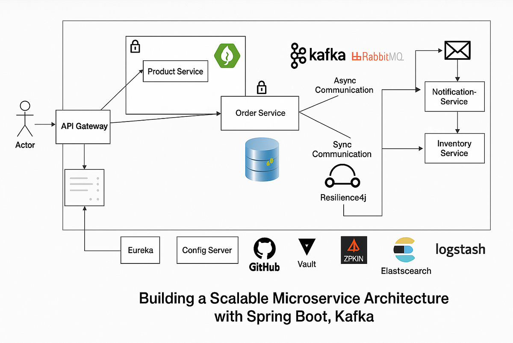

# _**Asynchronous**_ communication use _**Kafka**_



## **`1.` `Kafka`** - **_Dump_** broker - **_Smart_** Consumer

Khác với **RabbitMQ** là **Message Queue** / **Message Broker**, `Kafka` là **event streaming platform**.

|   Tiêu chí   |         **Kafka**         |         **RabbitMQ**         |
| :----------: | :-----------------------: | :--------------------------: |
| `Throughput` | Cực cao (`triệu msg / s`) | Trung bình (`nghìn msg / s`) |
|   Lưu trữ    | Lâu dài (`configurable`)  |    Xóa sau khi `consume`     |
|    Replay    |   Có - `rewind offset`    |            Không             |
|   Ordering   | Đảm bảo trong `partition` |    Đảm bảo trong `queue`     |
| **Use case** |   Event streaming, log    |       RPC, task queue        |

---

## **_SHOULD NOT_ use Kafka Use case**

- **Simple `RPC` request/reply** -> `REST` / `gRPC`
- Message queue **nhỏ**, **ít traffic** -> `RabbitMQ`
- Cần **Complex Routing** với exchange -> `RabbitMQ`

---

## **Kafka's _Components_**:

- **`Broker`**: **Kafka server**, lưu: `topic`, `partition` và `message log`

- **`Topic`**:
  - Tất cả `event` sẽ được **ghi nối tiếp nhau** vào một **Topic**, ex: topic `user-events`

  - Điểm **ĐẶC BIỆT** của `kafka` là: **Đọc xong không mất data**, data vẫn nằm đó cho tới khi **hết hạn** (`Retention` policy, mặc định 7 ngày)

- **`Partition`**:
  - `Kafka` chia **Topic** ra thành nhiều **Partition** (0, 1, 2, ...).
  - Nhờ vậy, có thể gắn **`N Broker Server`** để **đọc/ghi song song**. Đây là điểm **cốt lõi** có thể giúp `kafka` đặt tới `triệu msg/s`

- **`Offset`** - Marker:
  - Vì không xóa message sau khi đọc, `Kafka` cung cấp cơ chế **Offset** là số thứ tự 0, 1, 2, ... (số thứ tự của `last message`) giúp **consumer** có thể xác định nó **đã đọc tới đâu**.

  - Cách lưu:

    ```text
    offset 0 -> message1
    offset 1 -> message2
    ...
    ```

- **`Consumer Group`**:
  - Giả sử có `3 instance` của **NotificationService** chạy để chia tải. Ta cần gom 3 instance vào chung `groupId="notification-group"`.
  - Sau đó, `Kafka` sẽ chia **Partition** cho 3 instance đọc => **Đảm bảo chỉ 1 instance trong group đọc được và thực hiện task**

    _**Ví dụ**_: Khi có **6 Partions** và **3 Consumers**, mỗi consumer sẽ được chia **2 Parttions**. Nếu có **>6 Consumers**, khi này, chỉ có **6 Consumers** hoạt động, các consumer còn lại **idle**.

  - **Điều kiện để Scale**: `Max số consumer hoạt động song song` = `số Partion`

```plaintext
┌─────────────────────────────────────────────────────────────┐
│                        Kafka Cluster                        │
│                                                             │
│  ┌──────────────┐    ┌─────────────┐    ┌─────────────┐     │
│  │  Broker 1    │    │  Broker 2   │    │  Broker 3   │     │
│  │───────────── │    │─────────────│    │─────────────│     │
│  │ Topic: orders│    │Topic: orders│    │Topic: orders│     │
│  │ Partition 0  │    │ Partition 1 │    │ Partition 2 │     │
│  │ (Leader)     │    │ (Leader)    │    │ (Leader)    │     │
│  │ Partition 1  │    │ Partition 0 │    │ Partition 1 │     │
│  │ (Follower)   │    │ (Follower)  │    │ (Follower)  │     │
│  └──────────────┘    └─────────────┘    └─────────────┘     │
│                                                             │
│  ┌──────────────────────────────────────────────────────┐   │
│  │              ZooKeeper / KRaft (mới)                 │   │
│  │         (Quản lý metadata, leader election)          │   │
│  └──────────────────────────────────────────────────────┘   │
└─────────────────────────────────────────────────────────────┘
        ↑ produce                             ↓ consume
┌──────────────┐                    ┌──────────────────────┐
│   Producer   │                    │  Consumer Group A    │
│ (Spring Boot)│                    │  Consumer 1, 2, 3    │
└──────────────┘                    └──────────────────────┘
```

## **`2.` Triển khai _`Kafka`_** : [Implement Kafka]=

### **`2.1.` Setup Kafka _Broker_ in _Docker_**

Tạo [docker-compose.yaml](/codes/monorepo-microservice-example/docker-compose.yml)

```yaml
services:
  kafka:
    image: apache/kafka:latest
    ports:
      - "9092:9092" # Internal communicate (within Docker network)
      - "9094:9094" # External communicate (with localhost machine)
    environment:
      # --------- KRaft metadata & Node Identity ---------
      # __________________________________________________
      # CLUSTER_ID: nhóm nhiều Kafka broker hoạt động cùng nhau.
      #   + quản lý: metadata của cluster
      KAFKA_CLUSTER_ID: "W81MS10BTyiCv-5VKd6fBA" # Kafka cluster unique ID (required for Kafka mode)
      # NODE_ID: Kafka node unique id
      #   + Mỗi broker -> 1 kafka node
      KAFKA_NODE_ID: 1
      # PROCESS_ROLE:
      #   + broker: lưu trữ dữ liệu
      #   + controller: quản lí trạng thái cluster (thay cho zookeeper)
      # do chỉ sử dụng 1 node nên đảm nhiệm cả broker và controller
      # thực tế:
      #   + node1 -> controller
      #   + node2 -> broker
      #   + node... -> broker
      KAFKA_PROCESS_ROLES: "broker,controller"

      # --------- Controller Quorum Configuration ---------
      # Cấu hình thuật toán đồng thuận Raft
      # __________________________________________________
      # CONTROLLER_QUORUM_VOTERS: List of controller nodes that form the Raft quorum // người bỏ phiếu
      KAFKA_CONTROLLER_QUORUM_VOTERS: 1@kafka:9093
      KAFKA_CONTROLLER_LISTENER_NAMES: "CONTROLLER" # name used by controllers

      # --------- Network Listeners ---------
      # __________________________________________________
      # LISTERNER: listeners endpoints for this Kafka node:
      #   + PLAINTEXT: giao tiếp nội bộ Docker container
      #   + EXTERNAL: cho phép máy host bên ngoài giao tiếp
      #   + CONTROLLER: Raft controller
      # 0.0.0.0 -> listen tất cả network interface.
      KAFKA_LISTENERS: >
        INTERNAL://0.0.0.0:9092, 
        EXTERNAL://0.0.0.0:9094,
        CONTROLLER://0.0.0.0:9093
      # ADVERTISED_LISTENER: địa chỉ trả về khi kafka client connect tới
      KAFKA_ADVERTISED_LISTENERS: >
        INTERNAL://kafka:9092,
        EXTERNAL://localhost:9094
      # LISTENER_SECURITY_PROTOCOL_MAP: map listener name to their sercurity protocol
      KAFKA_LISTENER_SECURITY_PROTOCOL_MAP: >
        INTERNAL:PLAINTEXT,
        EXTERNAL:PLAINTEXT,
        CONTROLLER:PLAINTEXT
      # INTER_BROKER_LISTENER_NAME: listener brokers used for intenal communicate
      KAFKA_INTER_BROKER_LISTENER_NAME: "INTERNAL"

      # --------- Single-Node Cluster Safety setting ---------
      # vì là single node nên chỉ có thể có 1 replication
      # __________________________________________________
      # OFFSETS_TOPIC_REPLICATION_FACTOR: số replication
      KAFKA_OFFSETS_TOPIC_REPLICATION_FACTOR: 1
      KAFKA_TRANSACTION_STATE_LOG_REPLICATION_FACTOR: 1
      KAFKA_TRANSACTION_STATE_LOG_MIN_ISR: 1 # ISR: In Sync Replica

      # --------- Broker Defaults & Quality-of-Life Settings ---------
      # __________________________________________________
      # Speed up consumer group startup -> consumer group start ngay
      # default 3s delay
      KAFKA_GROUP_INITIAL_REBALANCE_DELAY_MS: 0
      # cho phép tự tạo topic khi producer gửi mà topic chưa có trước
      KAFKA_AUTO_CREATE_TOPICS_ENABLE: "true"
      # NUM_PARTITIONS: default amount of partition per topic
      KAFKA_NUM_PARTITIONS: 1

    # Phân vùng:
    volumes:
      # ánh xạ kafka data: `/var/lib/kafka/data` -> topic, partitions, logs
      # ra `./docker/kafka/data`
      - ./docker/kafka_data:/var/lib/kafka/data

  kafka-ui:
    image: provectuslabs/kafka-ui:latest
    depends_on:
      - kafka
    ports:
      - "8070:8080" # http://localhost:8070
    environment:
      KAFKA_CLUSTERS_0_NAME: local
      KAFKA_CLUSTERS_0_BOOTSTRAPSERVERS: kafka:9092 # use internal docker network
      DYNAMIC_CONFIG_ENABLED: "true" # enable add cluste from UI
    restart: unless-stopped

volumes:
  kafka_data:
```

---

### **`2.2.` Dependencies**

```kotlin
implementation("org.springframework.boot:spring-boot-starter-kafka")
```

---

### **`2.3.` Configuration**

**Kafka `Bootstrap Server`**:

```yml
# application.yaml / application.properties
#   common kafka properties
spring:
  kafka:
    # bootstrap-server -> connect to kafka broker
    #   + nếu project chạy trong docker container cùng với kafka container:
    #     -> mapping với INTERNAL (localhost:9092)
    #   + nếu project chạy bên ngoài docker
    #     -> mapping với EXTERNAL (localhost:9094)
    bootstrap-servers: localhost:9094
```

> **Trong thực tế**, pattern phổ biến nhất là **_config ở `appication.yaml` cho tất cả những gì YAML làm được_**, **`code Java`** chỉ **_cho phần còn lại_**, bao gồm `Listener's behavior`. Đây không phải là nguyên tắc cứng nhắc mà là hệ quả tự nhiên của việc **_giảm thiểu sự phức tạp_**.

- `config` và `behavior`:
  - `Thứ này có thay đổi giữa các môi trường (dev, stagging, production, ...) không?`: nếu **CÓ** => nên được `config` trong **application.yaml**.
  - `Thứ này có thể diễn đạt bằng một giá trị đơn giản không?`: nếu **KHÔNG**, cần logic xử lý => nên là `behavior` và được triển khai config bằng **code**
    - `ErrorHandler`
    - `MessageConverter` (StringDeserializer, ...)
    - `TypeMapper`
    - `TransactionManager`
    - `RecordInterceptor`
    - `BatchListener`
    - ...
      Nên được config bằng **code**

**Cụ thể hơn**:

- `ConsumerFactory`/`ProducerFactory`: **GIỮ NGUYÊN**.  
  Đây là những thứ **_ổn định, ít thay đổi_** được Spring Boot `auto-configure` từ **application.yaml**
- Với consumer, có thể viết `@Bean` cho `ConcurrentKafkaListenerContainerFactory` để config behavior cho Listener.
- Phía producer thường ít cần config hơn.

#### **`2.3.1.` _Advanced_ `Producer` configuration**: [Advanced Producer Configuration](./advanced-config/Producer.md)

#### **`2.3.2.` _Advanced_ `Consumer` configuration**: [Advanced Consumer Configuration](./advanced-config/Consumer.md)

---

### **`2.4.` Triển khai `producer` & `consumer`**

Phụ thuộc vào việc **`Serializer`**/**`Deserializer`**, có một số cách triển khai:

- #### `string-based` messaging: [string-based messaging](./StringBasedMessage.md)
- #### `json-based` messaging: [json-based messaging](./json-based/readme.md)

---

### **`2.5.` (`Optional`) Advanced**

#### **`2.5.1.` Producer**

#### **`2.5.2.` Consumer**: [Advanced Listener](./advanced/AdvancedListener.md)

---

## **`3.` Một số vấn đề**

#### **`Topic` _Naming Rules_**

- có thể sử dụng `.`, `-`, `_` làm dấu phân cách.

- **_`Multi-Topic`_**: **`One Message-Type` (One `Event`) per `Topic`**

  ```plaintext
  <environment>.<domain>.<classification>.<description>.<version>
  ```

  Trong đó:
  - `<enviroment>`: `dev`, `staging`, `prod` -> giúp tách biệt dữ liệu giữa các môi trường nếu dùng chung Cluster
  - `<domain>`: entites -> `order`, `payment`, ...
  - `<classification>`: loại dữ liệu -> `events`, `commands`, `fct` (fact), `cdc` (change data capture), ...
  - `<description>`: sumary -> `created`, `status-changed`, ...
  - `<version>`: version của **schema** -> **RẤT QUAN TRỌNG** khi thay đổi **cấu trúc message** mà không muốn làm sập các consumer cũ

  Example: `log.<service-name>.<level>`(**Logging**, ex: _log.user.error_), `<domain>.<entity>.<action>` / `<domain>.<classification>.<event>`, (**Entity Events**, ex: _user.events.created_), `<cdc>.<db-name>.<table-name>`( **CDC**, ex: _cdc.inventory.products_), `<original-topic>.retry` (**Internal/Retry**)

  > _Dùng **nhiều topic** khi các loại **sự kiện không liên quan đến nhau về mặt thứ tự** và có **các nhóm Consumer khác hẳn nhau** hoặc cần **thông lượng lớn** / **consumer scale khác nhau**_

- **_`Single-Topic`_**: **`Multiple Message-Types` in `One-Topic`**:
  - Phân biệt **Message**:
    - **Producer Type Header**: `__TypeId__ = user.created.v1`
    - **Custom Header**: `event-type: user.created.v1`
    - **Payload**: `{eventType: user.created.v1, ...}`
  - **Naming Rule**:
    - **Topic**: `<env>.<domain>.<entity>.events` (nếu domain có nhiều entity) / `<env>.<domain>.events` (nếu domain chính là entity) (linh hoạt bỏ/giữ `<env>`)
    - **Event Type**: `<entity>.<action>`
    - **Message Key**: thường là `entityId`
  - **Tại sao phải có Naming Rule cho cả `Message Key`?**
    - Trong mô hình gộp nhiều event vào 1 topic, cái Key là "linh hồn" của việc đặt tên.
    - `Quy tắc`: Tất cả các Event-Type trong cùng một Topic phải dùng chung một loại Key (ví dụ đều dùng orderId).
    - `Tại sao`: Để đảm bảo tất cả các sự kiện của cùng một đơn hàng ORD-123 (từ lúc tạo đến lúc hủy) đều nhảy vào cùng một Partition. Nếu ông đổi Key (lúc dùng orderId, lúc dùng customerId), thứ tự xử lý sẽ loạn hết cả lên.

      > Kafka dùng key để quyết định partition: `partition = hash(key) % number_of_partitions`

  - **Ưu điểm**:
    - giảm số lượng Topics cần quản lý
    - **đảm bảo thứ tự** (do Kafka chỉ đảm bảo thứ tự trong cùng Partition)
  - **Nhược điểm**:
    - Network Bandwidth: vì phải xử lý toàn bộ message từ topic, kể cả loại nó không quan tâm
    - CPU & Deserialization
    - Lag & Offset: các event không quan tâm chiếm số lượng quá lớn
  - **Sử dụng khi**:
    - Cần ưu tiên thứ tự.
    - Lưu lượng vừa phải
