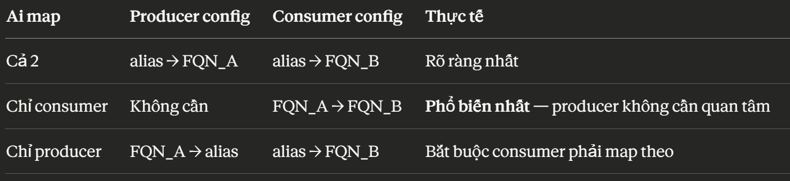

# **_`JSON-based`_** messaging

**Notes**:
All `Jackson 2` classes now have `Jackson 3` **counterparts with consistent naming and improved type safety**:

- `JsonKafkaHeaderMapper` replaces `DefaultKafkaHeaderMapper`
- `JacksonJsonSerializer`/`JacksonJsonDeserializer` replaces `JsonSerializer`/`JsonDeserializer`
- `JacksonJsonSerde` replaces `JsonSerde`
- `JacksonJsonMessageConverter` family replaces `JsonMessageConverter` family
- `JacksonProjectingMessageConverter` replaces `ProjectingMessageConverter`
- `DefaultJacksonJavaTypeMapper` replaces `DefaultJackson2JavaTypeMapper`

## Behind the screen

Điều quan trọng nhất cần nhớ là Kafka không biết gì về JSON, Java, hay kiểu dữ liệu. **Kafka chỉ lưu trữ và truyền tải `byte[]`** (mảng byte thuần). Vì vậy, toàn bộ câu chuyện JSON messaging thực chất là câu chuyện về serialization (Java object → bytes khi gửi) và deserialization (bytes → Java object khi nhận)

Vì vậy, vấn đề `JSON Serialize/Deserialize` là vấn đề chính cần giải quyết.

**Tại sao lại là JSON**:

- `StringSerializer`:
  - **Không có cấu trúc** => phải tự định nghĩa cách phân tách các phần tử, thứ tự các phần tử và thống nhất khi serializer và deserializer
  - cần mapper hoặc kỹ thuật phân tách khi serializer và deserialize.
  - StringSerializer cũng khó scale khi muốn thay đổi cấu trúc message vì **đ có cấu trúc :))**
  - ...
- Java's native serialization - `ObjectSerializer`: chỉ Java đọc được

- `JSON`: Là ngôn ngữ chung trong hệ thống microservices, bất kì ngôn ngữ lập trình nào cũng hỗ trợ.
  - Dữ liệu có cấu trúc, lưu theo cặp `key:value`
  - An toàn khi thay đổi cấu trúc message.
  - Thư viện hỗ trợ serialize/deserializer sẵn
  - Human-readable
  - Khả năng debug
  - ...

  **Tóm lại**, `Json` giải quyết vấn đề chính: **Khả năng tương tác giữa các `services`**

**Khi nào không dùng `JSON`**

- **High performance**: khi cần tối ưu hiệu năng và băng thông mạng
  > _JSON là dạng text nguyên bản, **`chứa rất nhiều ký tự định dạng`** (như dấu ngoặc `{}`, dấu ngoặc kép `""`, dấu phẩy `,`). Bên cạnh đó, quá trình `serialize`/`deserialize` tốn nhiều **chu kì CPU** để xử lý chuỗi_
- cần `schema evolution` được kiểm soát chặt chẽ (thay đổi field name mà không làm vỡ consumer cũ), hoặc cần validation tự động theo schema

  => Giải pháp: `Avro`/`Probuf`

---

## **Triển khai**

### **`1.` Configuration**

#### **Producer** side

```yml
spring:
  kafka:
    bootstrap-servers: localhost:9094
    producer:
      # key-serializer: StringSerializer là đủ
      key-serializer: org.apache.kafka.common.serialization.StringSerializer
      # value-serializer: JacksonJsonSerializer (cũ là JsonSerializer)
      value-serializer: org.springframework.kafka.support.serializer.JacksonJsonSerializer # Java Object -> JSON

      compression-type: snappy # nén message trước khi gửi //snappy/gzip/lz4

      properties:
        spring.json.add.type.headers: true # bổ sung __TypeId__ để consumer biết mapping vào class nào (default là true)
```

#### **Consumer** side: [Consumer Configuration](./ConsumerConfiguration.md)

---

### **`2.` Triển khai**

#### `Phía gửi`: tương tự String-based

```kotlin
try {
    // CompletableFuture => chạy async
    CompletableFuture<SendResult<String, Object>> failure = kafkaTemplate.send(
        KafkaProduceConstants.UserEvents.USER_EVENTS_TOPIC, // topic
        messageId,// key, với multi-types message per topic, key should be entity.id
        message// value
    );
    // note: kafka.Template.send(...).get() // get() block thread hiện tại -> sync

    failure.whenComplete((result, ex) -> {
        if (ex != null) {
            System.out.printf("[Async Communicate - Kafka]: FAILED send message with id: %s\n", messageId);
        } else {
            System.out.printf("[Async Communicate - Kafka]: send message with id: %s\n", messageId);
            System.out.printf(
                    "[Async Communicate - Kafka]: topic: %s, partition: %d, offset: %d\n",
                    result.getRecordMetadata().topic(),
                    result.getRecordMetadata().partition(),
                    result.getRecordMetadata().offset()
            );
        }
    });
} catch (Exception e) {
    System.out.println(e.getMessage());
}
```

#### `Phía nhận`:

- Sử dụng `@KafkaListener` cho method:

  ```kotlin
  @KafkaListener(
      topics = [KafkaConsumeConstants.UserEvents.USER_EVENTS_TOPIC],
      groupId = KafkaConsumeConstants.GROUP_ID,
  )
  fun handleUserCreateEvent(
      @Payload
      request: WelcomeMailRequest, // JSON parse chính xác -> match

  ) {
      // notificationService.sendWelcomeMail(request);
      println("receive event: $request")
  }
  ```

  **Tuy nhiên**: khi `Deserialize Error` (Parse Error, invalid JSON type, no-maching class, ...) -> `lỗi` + `retry` (có thể dẫn tới `infinite-loop`)

- Sử dụng `@KafkaLister` cho class và khai báo **DefaultHanlder - `@KafkaHandler(isDefault = true)`** xử lý trường hợp `no-maching class`:

  ```kotlin
  @Component
  // Multiple message-type in one topic
  @KafkaListener(
      topics = [KafkaConsumeConstants.UserEvents.USER_EVENTS_TOPIC],
      groupId = KafkaConsumeConstants.GROUP_ID,
  )
  class UserEventListener(
      private val notificationService: NotificationService
  ) {

      // ____________________ @Payload Matching Specific Type ____________________ //
      @KafkaHandler // handle 1 loại message type
      fun handleUserCreateEvent(
          @Payload
          request: WelcomeMailRequest, // JSON parse chính xác -> match
      ) {
          // notificationService.sendWelcomeMail(request);
          println("receive event: $request")
      }

      // ____________________ Default Handler ____________________ //
      // khi JSON parse không match request nào
      // bắt buộc hứng để tránh lỗi
      //  => sử dụng cho các message mà nó không quan tâm
      @KafkaHandler(isDefault = true)
      fun handleUnknowMessage(
          @Payload
          payload: Any, // payload only

          @Header(KafkaHeaders.RECEIVED_TOPIC) topic: String,
          @Header(KafkaHeaders.RECEIVED_PARTITION) partition: Int,
          @Header(KafkaHeaders.RECEIVED_TIMESTAMP) timestamp: Long,
          @Header(KafkaHeaders.OFFSET) offset: Long,

          // full-message
          message: ConsumerRecord<String, Any>
      ) {
          println("[Default Handler] receive event: $message ")
      }
  }
  ```

---

## **`3.` Một số vấn đề**

### **`3.1.` Bên nào nên định nghĩa TypeMapping?**



> _Cá nhân mình thấy cả 2 hợp lí hơn_
