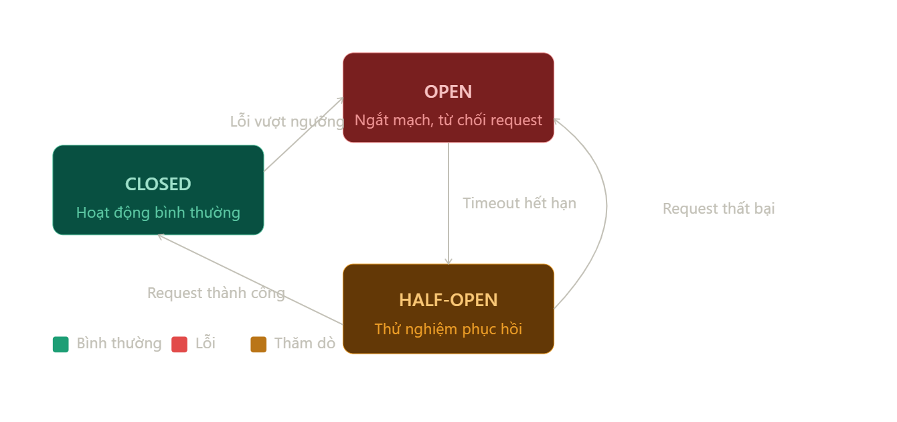
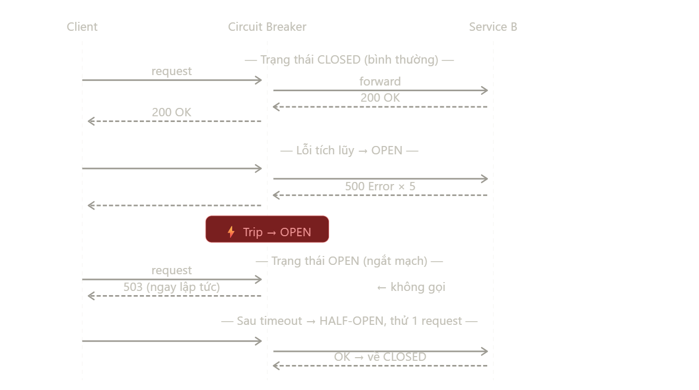

# **Circuit Breaker: `spring-cloud-starter-circuitbreaker-resilience4j`**

## **`1.` _Ý tưởng_ và _Nguyên lí hoạt động_**

### **1.1. Ý tưởng cốt lõi**:

Thay vì để **`service A` liên tục gọi sang `service B` đang bị lỗi**, dẫn tới **timeout**, **tốn tài nguyên**, **cascade failure**, ... **`Circuit Breaker (CB)`** sẽ **chặn request** và **trả về ngay lập tức**

### **1.2. Circuit Breaker _States_**:

- **`CLOSED`**: là `trạng thái đóng` (**bình thường**), khi `request` được thực hiện **thành công**, **hệ thống ổn định**. Khi này, các request trong tương lai tiếp tục được thực hiện bình thường mà không bị cản trở.
- **`OPEN`**: là `trạng thái mở` (tức là mạch không thông suốt, **request không đi qua được**). Khi tỉ lệ lỗi **vượt ngưỡng cho phép**, cho thấy `service B` **KHÔNG ỔN ĐỊNH**, lập tức chuyển trạng thái `OPEN`.

  Mọi request tiếp theo sang B sẽ bị chặn (`fail-fast`) và trả về `lỗi` / **phương án dự phòng** (`fallback`) mà không cần tốn thời gian chờ của client.

  Điều này nhằm mục đích: **Cho phép `B` có _thời gian phục hồi_**.

- `HALF-OPEN`: sau một thời gian ở trạng thái `OPEN`, cho phép vài request từ `A` chạy thử sang `B`. Nếu thấy `B` đã ổn định, trở về trạng thái `CLOSED`, ngược lại, tiếp tục trạng thái `OPEN`

---

## **`2.` Circuit Breaker _Implementation_**

### **`2.1.` Dependencies: `Resilience4j`**

**`spring-cloud-starter-circuitbreaker-resilience4j`** vs **`resilience4j-spring-boot3`**

- `spring-cloud-starter-circuitbreaker-resilience4j` là **`abstraction layer`** do **Spring Cloud** tạo ra, wrap `Resilience4j` bên trong.

  Thư viện này cung cấp một `API` trung lập - `CircuitBreakerFactory` - có thể hoạt động tốt với bất kì loại **Circuit Breaker** nào, như `Resilience4j`, `Hystrix`, `Sentinel`, ... mà không cần sửa code.

  Tuy nhiên, để phù hợp với bất kì CB nào, **`abstraction layer`** này:
  - **Lowest Common Denominator**: loại bỏ bớt tính năng.  
    Ví dụ, nó bỏ qua hầu hết các tính năng xịn nhất của **`Resilience4j`** như `@Retry`, `@BulkHead`, `@RateLimiter`, `@TimeLimiter`
  - **Nghiệp vụ lẫn lộn với logic hạ tầng**: phải tạo **CircuitBreaker's intance** thông qua `CircruitBreakerFactory.create("...")` và chạy business logic bên trong instance đó.

- `resilience4j-spring-boot3`: là `native starter` — **dùng thẳng `Resilience4j` không qua trung gian**, nên có **full feature set** và **annotation** đầy đủ

|                                                                                                  | `resilience4j-spring-boot3` | `spring-cloud-starter-circuitbreaker-resilience4j` |
| :----------------------------------------------------------------------------------------------: | :-------------------------: | :------------------------------------------------: |
|                                      Wrapable sang CB khác                                       |            Không            |                       **Có**                       |
| Fully `Resilience4j` annotations: `@Retry`, `@Bulkhead`, `@RateLimiter`, `@TimeLimiter`, ... |           **Có**            |                       Không                        |
|                              Khả năng config qua `application.yaml`                              |         **Đầy đủ**          |                      Hạn chế                       |
|                                             Thực tế                                              |       **Dùng nhiều**        |                    Ít dùng hơn                     |

Thực tế, **rất ít khi** sử dụng nhiều `CB` trong 1 project nên **abstraction layer** của Spring Cloud gần như **không có tác dụng**

### **`2.2.` Triển khai**

- Only `spring-cloud-starter-circuitbreaker-resilience4j`: [Details](./spring-cloud-starter-circuitbreaker-resilience4j/withoutOpenFeign.md)
- `spring-cloud-starter-circuitbreaker-resilience4j` with `OpenFeign` (thường là đủ dùng nếu project chỉ dùng OpenFeign để gọi service ngoài): [Details](./spring-cloud-starter-circuitbreaker-resilience4j/withOpenFeign.md)
-
